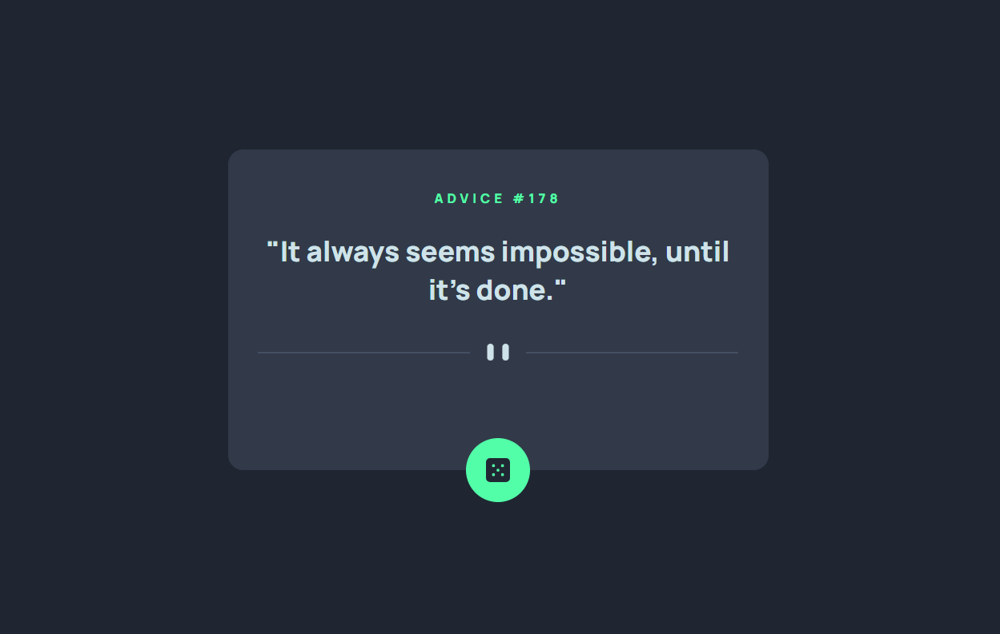
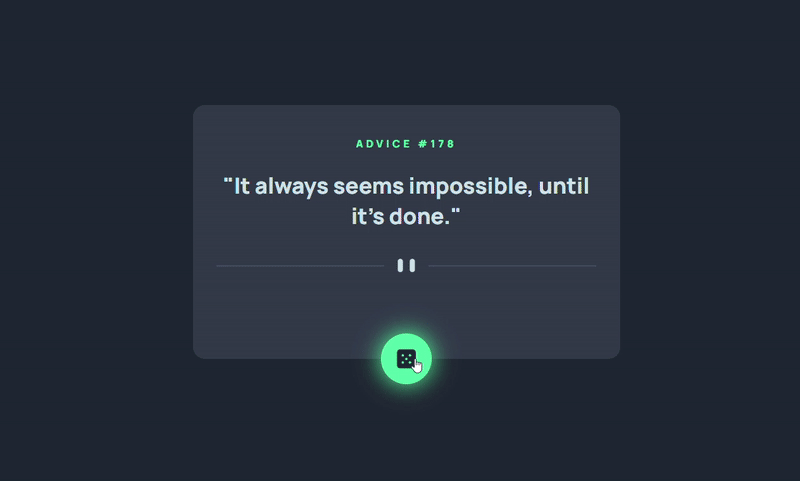

# 🧠 Advice Generator App

A simple and fun **Advice Generator App** that fetches random pieces of advice from the *Advice Slip API* and displays them on the page when the user clicks a button.

---

## 📖 Project Overview

This app is designed to:

- Interact with a public API to fetch dynamic data.
- Practice **fetch requests**, **DOM manipulation**, and **event handling** in JavaScript.
- Demonstrate clean, responsive HTML/CSS UI.

---

## 📝 Approach Explained

1. **HTML Structure**  
   - Basic layout with an advice text area and a button.  
   - Icons and patterns enhance the visual style.

2. **CSS Design**  
   - Responsive and clean layout.  
   - Uses Flexbox for alignment and spacing.

3. **JavaScript Logic**  
   - On page load and button click, the app performs `fetch()` to get advice from:

     ```
     https://api.adviceslip.com/advice
     ```
     (Advice Slip API).  
   - The response is parsed and inserted into the DOM.  
   - Minimal error handling ensures the UI doesn’t break if the request fails.

---

## ⏱️ Time & Space Complexity

- **Time Complexity:** O(1) — each advice fetch is a single network request and does not grow with input size.  
- **Space Complexity:** O(1) — only a few DOM elements are updated; no large data structures are stored.

---


### Final UI Screenshot


### Optional Interaction GIF


*(Record the advice changing on click for added polish.)*

---

## 🎨 Design Explanation

- **Color & Typography:** Clean and minimal to keep focus on advice content.  
- **Responsive Layout:** Works on mobile and desktops.  
- **Interactive Button:** Clicking the dice icon (or button) fetches and displays new advice instantly.  
- **Visual Feedback:** Quick transitions and simple animations make interaction feel smooth.

---

## 🧠 Technologies Used

- **HTML5**  
- **CSS3**  
- **JavaScript (ES6)**  
- **Advice Slip API** (for fetching advice)

---

## 🚀 Demo

You can view the live app here:  
[https://Shanmukhapriya3028.github.io/advice_generator_app/](https://Shanmukhapriya3028.github.io/advice_generator_app/)

---

## 📁 Project Structure

advice_generator_app/
├── index.html
├── style.css
├── script.js
├── images/
│ ├── icon-dice.svg
│ ├── pattern-divider-mobile.svg
│ ├── pattern-divider-desktop.svg
│ ├── demo-screenshot.png
│ └── demo.gif
└── README.md
